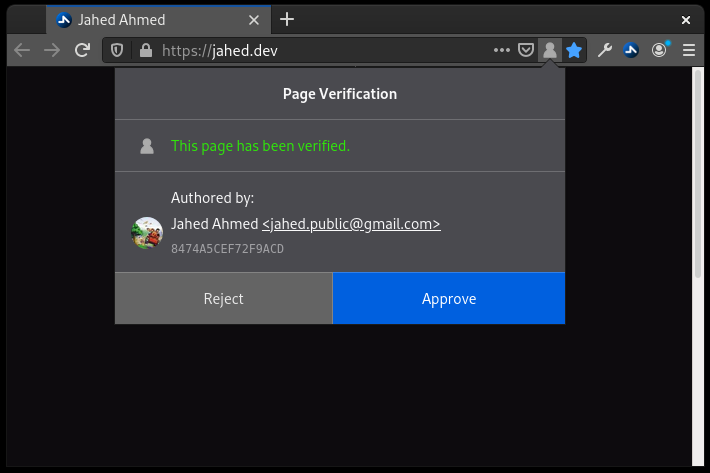
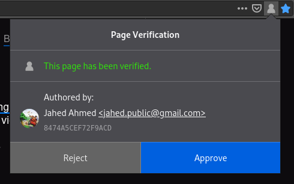
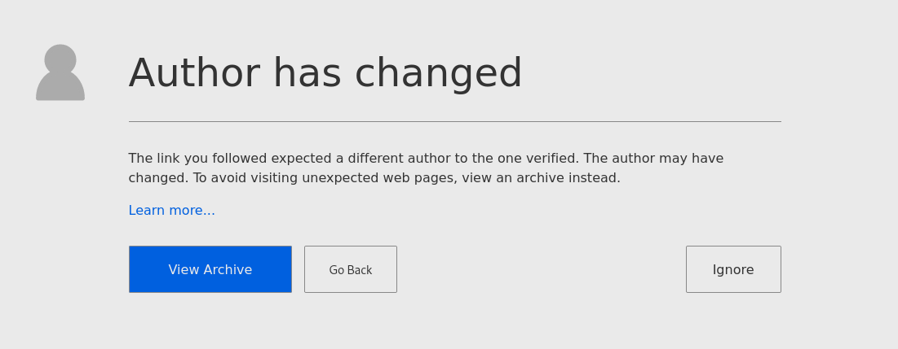

# WebVerify

Verify authorship of webpages.

## Introduction

The World Wide Web is driven by hyperlinks. Yet, a lot of the time we'll follow a link and end up on a completely different page to what we'd expect. Throughout a link's life, its domain will change owners, its servers will change owners, its content will be modified by other authors. Nothing is permanent.

Wouldn't it be nice if we could link to a page and ensure it remains under the same author? And if authors didn't have to worry about paying for a domain to stop all those links going to fishy websites?

WebVerify provides a solution to exactly this problem. To summarise:

* Authors sign web pages.
* Links enforce authorship.
* Readers verify authors.



## Signing pages

Authors sign web pages.

For this example, we'll be signing an `index.html` page.

1\. Generate a PGP key pair if you haven't already. Make sure it has a name and email attached.

```bash
gpg --full-generate-key
```

2\. Upload your public key to [https://keys.openpgp.org/](https://keys.openpgp.org/) and verify your email address.

3\. Decide where you're going to place your signature. It can be an absolute URL or a relative path. For example:

```
https://your.domain/path/to/index.html.sig
./index.html.sig
```

4\. Add your signature path to your page:

```markup
<link rel="signature" href="./index.html.sig" />
```

5\. Sign the web page using `gpg` on any other OpenPGP tool to generate a detached armored signature.

```bash
gpg --detach-sign --armor --local-user "${author_email}" --output "${sig_path}" "${html_path}"
```

6\. You're done! WebVerify will detect your signature and verify your web page.



### Avatars

Photo IDs aren't supported on keys.openpgp.org. Instead you can use your public key's verified email to upload an avatar to [Libravatar](https://www.libravatar.org/). Libravatar is a lot like Gravatar, except it uses [iavatar](https://git.linux-kernel.at/oliver/ivatar) which is open source.

If your email is under your own domain, you can also [run your own instance](https://wiki.libravatar.org/running\_your\_own/) and WebVerify will check your instance first before falling back to Libravatar.

### Dynamic pages

For dynamic pages, the same rules apply. Fully render your page first including the `<link />` tag, then generate the signature. Since the web page URL can have multiple signatures, you'll need to generate a unique signature path when the content differs.

### Cache conflicts

Caching can be a problem when you have two static endpoints that need to be in sync, in this case: the web page and signature. If a cached signature does not represent the current page, it will fail verification. This is similar to when your CSS or JavaScript goes out of sync so similar solutions apply. Some of those solutions include:

* Add `?v=1` to the end of your signature path and increment `v` any time there's a change.
* Use a placeholder for your signature path, hash the page and replace the placeholder with a hash-based path like `index.html.abc123.sig`.

### Subresource verification

Only the HTML source of the web page will be verified. External files like images, scripts and stylesheets are not verified. [Subresource Integrity](https://developer.mozilla.org/en-US/docs/Web/Security/Subresource\_Integrity) (SRI) already exists for some of those cases, and by including `integrity` attributes it can be assumed the content of those files are approved by the author. All that's left is for the web browser to do its job and verify the integrity.

SRI is not available for all content, like images. However, [according to the spec](https://www.w3.org/TR/SRI/), a future revision will include them.

### HTTP headers

Support for HTTP Headers will be added in the future.


## Linking to signed pages

To ensure a link to a web page is signed by a specific author, assign the link a key using a `<meta>` tag.

```markup
<meta name="webverify" content="https://your.domain/* 2020-11-25T00:00:00.000Z AKEY1ID123" />
```

* `name` must be `webverify`
* `content` must be one of:
  * `[url_prefix] [verify_date] [key_id]`
  * `[url_prefix] [key_id]`
* `url_prefix` must end in a `*`.
* `key_id` must be a 16-character long Key ID.
* `verify_date` must be in [ISO 8601](https://en.wikipedia.org/wiki/ISO\_8601) date and time format.

You can use multiple tags to match multiple links. The first `key_id` of the first `url_prefix` that matches will be enforced.

The `verify_date` is used for archive lookups if the author of the linked web page fails to match. It should be the date you last verified the authorship of the pages under the `url_prefix`.

### Example

```markup
<meta name="webverify" content="https://your.domain/* 2020-11-25T00:00:00.000Z AKEY1ID123" />
<meta name="webverify" content="https://example.com/users/bob* BKEY2ID567" />
<meta name="webverify" content="https://example.com/* CKEY3ID890" />
```

In the above example `https://example.com/users/bob/timeline` will match `BKEY2ID567` whereas `https://example.com/home` will match `CKEY3ID890`.



### Automation

Generating `<meta>` tags can be automated by scripting the following:

1. Find all the links on the web page.
2. Fetch each page, verify the signature and extract the `key_id` from it.
3. Assign the current date and time as `verify_date`
4. Assign the link as `url_prefix`

Once initially fetched, `<meta>` data should not be automatically changed. If your automation detects a `key_id` change, ensure any new authors are still valid and verified.

### Archives

To ensure pages have valid archives to fall back to for the given date, make sure it's saved in the [Internet Archive](https://archive.org/web/).

## Verifying authors

Just because a page is verified does not mean the author is credible. They may be impersonating someone else (in which case their Key ID won't match the real person), or they might just have the same name.

Who you trust and don't trust is ultimately up to you. Once you've personally verified an author, you can chose to "Approve" or "Reject" them.


Approving an author will highlight their icon in blue to show you've already verified them. It's similar to a bookmark.

Rejecting an author highlights their icon in blue with a red line across. Visiting a page authored by a rejected author will redirect to a warning page. You can choose to ignore the warning for the current tab.


## Examples

Once you have [installed the web extension](#installation), you can test it out on [the examples page](https://jahed.github.io/webverify/examples/index.html).

---

## Web extension

### Installation

The Web Extension is currently in development and only works on Firefox.

1. Download XPI file from [the latest release](https://github.com/jahed/webverify/releases/latest) of the Web Extension.
2. If you're using Firefox, a pop-up will appear to install it.

#### Manual installation

If you choose not to install the XPI from the download prompt, you can install it manually.

1. In Firefox, go to the Add-Ons Manager \(about:addons\)
2. Choose "Extensions" on the left menu
3. Click the Cog icon
4. Choose "Install Add-on From File..."
5. Choose the XPI you just downloaded.
6. You're done!

#### Contributing

You will need the latest Node LTS and Yarn installed.

Create a `web-ext` Firefox Profile by going to `about:profiles`.

```bash
git clone git@github.com:jahed/webverify.git
cd webverify
./develop.sh
```

This will install dependencies and launch Firefox using the `web-ext` profile with the extension installed and will automatically reload it when there are any file changes.

`web-ext` makes config changes so using any other profile is not recommended. Any changes you make within the `web-ext` window will not be saved. To make permanent changes, launch the `web-ext` profile from `about:profiles`.
